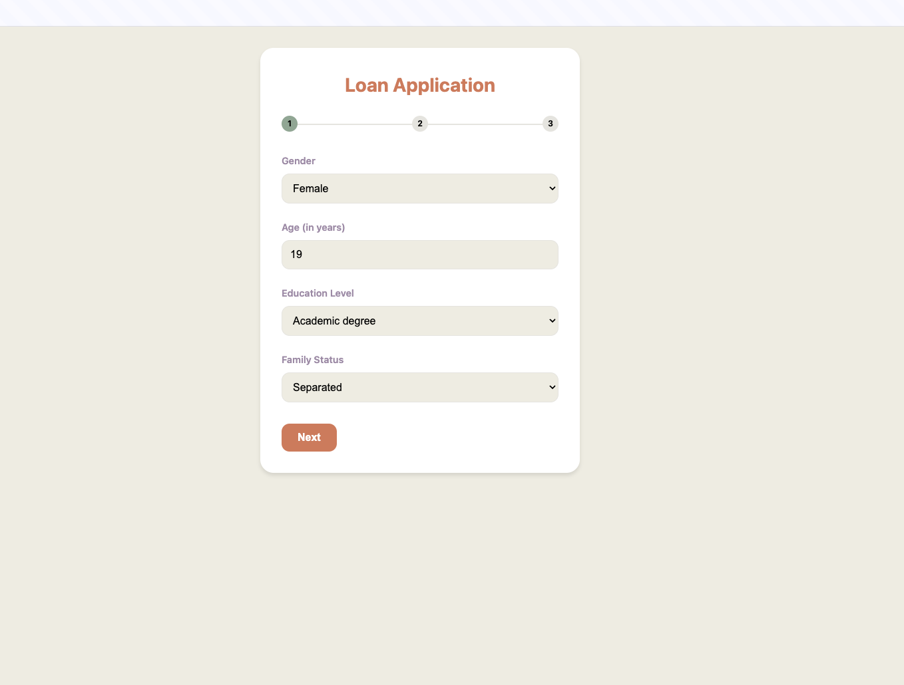
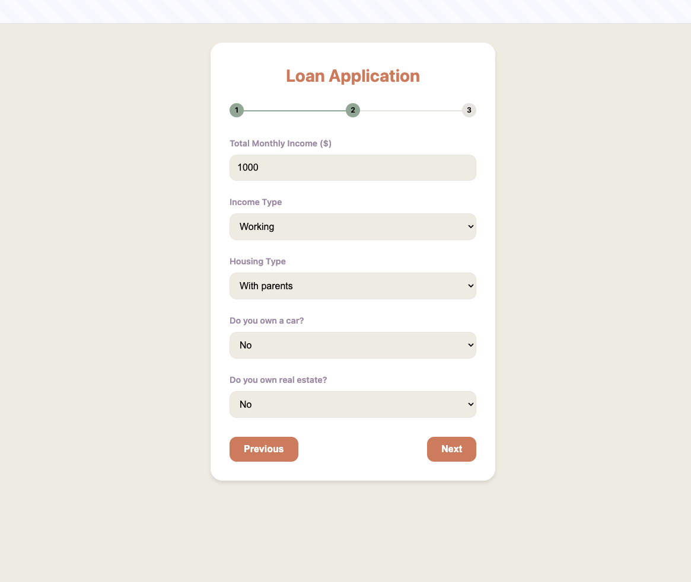
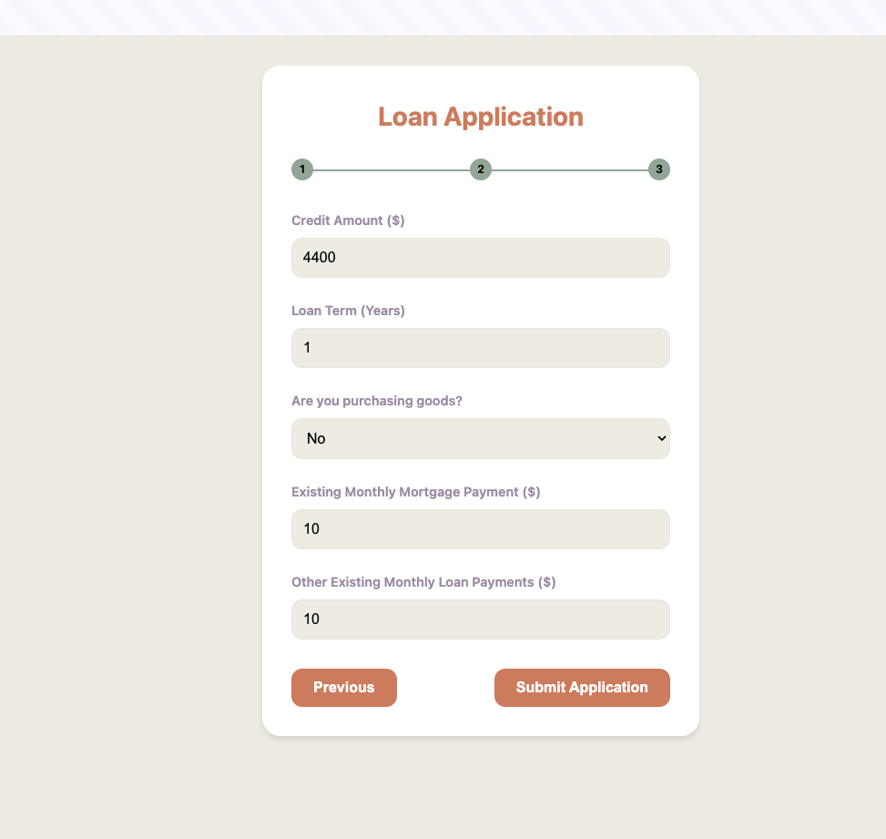
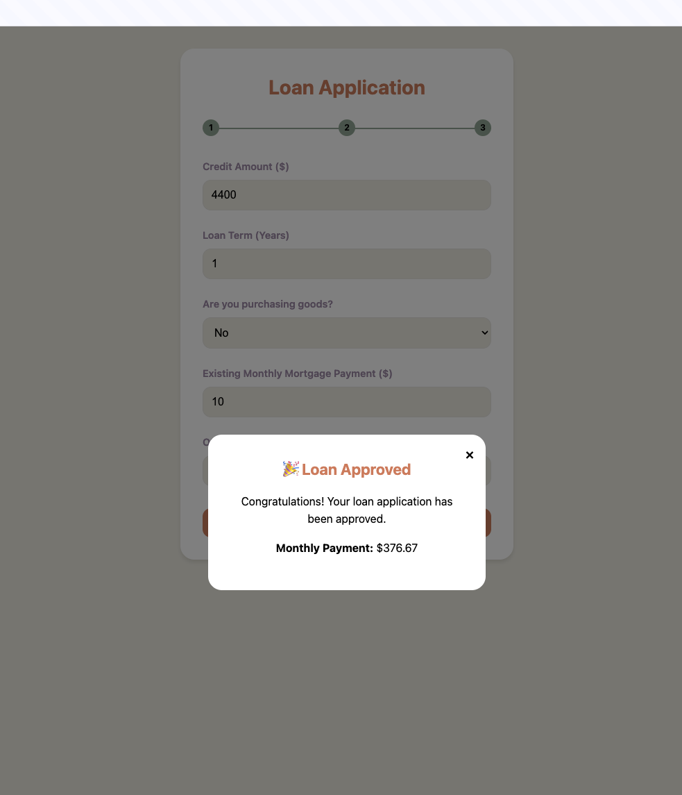
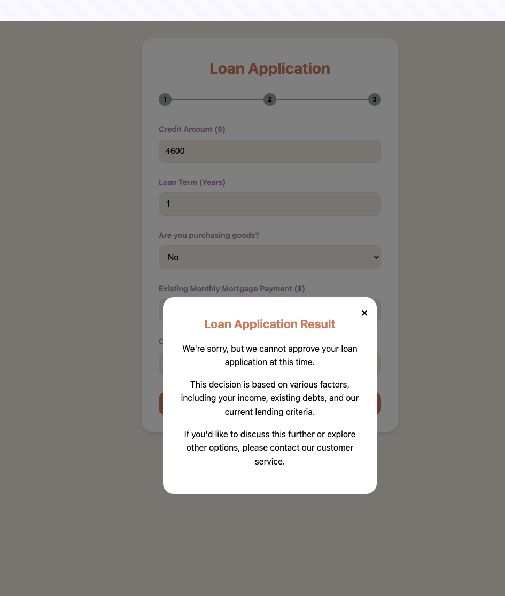

# Credit Risk Prediction Model

## Table of Contents

1. [Project Overview](#project-overview)
2. [Live Application](#live-application)
3. [Dataset Description](#dataset-description)
4. [Approach](#approach)
   - [Initial Model Development](#initial-model-development)
   - [Manual Fine-Tuning](#manual-fine-tuning)
5. [Results](#results)
6. [Key Findings](#key-findings)
7. [Feature Importance](#feature-importance)
8. [Installation Guide](#installation-guide)
   - [Using uv (Recommended)](#using-uv-recommended)
   - [Using pip (Alternative)](#using-pip-alternative)
9. [Deployment](#deployment)
10. [API Endpoints](#api-endpoints)
11. [User Interface](#user-interface)
12. [Future Improvements](#future-improvements)
13. [License](#license)

## Project Overview

This project focuses on developing, deploying, and serving a machine learning model for credit risk prediction using the Home Credit dataset. The goal is to create an interpretable, deployable, and financially sound model that effectively identifies potential loan defaulters while maintaining a balance between precision and recall.

## Live Application

The application is deployed and accessible at:
<https://retail-bank-risk-app-562777194669.us-central1.run.app/>

## Dataset Description

The Home Credit dataset contains information about loan applications, including:

- Applicant demographics
- Financial history
- Loan specifics
- External data sources

The main data tables used are:

- application_train.csv
- application_test.csv

## Approach

### Initial Model Development

1. **Data Preprocessing**:
   - Loaded and cleaned raw data
   - Performed memory optimization
   - Handled missing values and outliers
   - Created derived features

2. **Feature Engineering**:
   - Binned continuous variables (age, income, credit amount)
   - Created financial ratios (debt-to-income, credit-to-goods, annuity-to-income)
   - Engineered time-based features

3. **Model Development**:
   - Used XGBoost algorithm
   - Optimized hyperparameters using Optuna (200 trials)
   - Selected 40 key features for interpretability and relevance

4. **Evaluation Metrics**:
   - Focused on recall and F2-score
   - Analyzed precision-recall trade-offs

### Manual Fine-Tuning

5. **Enhanced Financial Analysis**:
   - Incorporated existing mortgage and loan payments
   - Implemented a comprehensive debt-to-income ratio calculation
   - Set a 40% threshold for total debt-to-income ratio

6. **Improved Risk Assessment**:
   - Adjusted default probability based on debt-to-income ratio
   - Implemented a more nuanced risk level determination

7. **Realistic Financial Assumptions**:
   - Used a 5% annual interest rate for loan calculations
   - Improved monthly payment calculations

8. **Expanded Anomaly Detection**:
   - Set specific bounds for key financial variables
   - Flagged and reported anomalies in model output

9. **Enhanced Error Handling and Logging**:
   - Improved input validation and error messaging
   - Added detailed logging of financial ratios and decision points

## Results

- Kaggle Competition Score: 67%
- Test Set Performance:
  - Recall: 74.42%
  - Precision: 11.23%
  - F1-Score: 19.52%
  - F2-Score: 35.02%
  - AUC-ROC: 0.6754

While these metrics indicate that the final model may not be the best in terms of raw performance, it's important to note that our manual fine-tuning process has significantly improved the model's effectiveness on edge cases. The incorporation of domain knowledge and financial best practices allows the model to make more nuanced and accurate decisions in complex scenarios that may not be well-represented in the general test set.

## Key Findings

1. The model demonstrates high recall (74.42%) for detecting defaults, crucial in credit risk management.
2. This high recall comes at the cost of low precision (11.23%), indicating a tendency to overpredict defaults.
3. The model errs on the side of caution, which may be acceptable if the cost of missing a default significantly outweighs the cost of false alarms.
4. The precision-recall curve suggests the model performs moderately well but is dealing with imbalanced data.
5. Manual fine-tuning improved the model's alignment with real-world financial decision-making processes, particularly for edge cases and complex scenarios.

## Feature Importance

Top features influencing the model's predictions include:

1. External source scores
2. Age
3. Income-related features
4. Loan amount and goods price
5. Various derived financial ratios

## Installation Guide

**Note:** This project uses Python 3.10 as specified in the `.python-version` file.

### Using uv (Recommended)

1. **Install uv:**

   ```bash
   # On Unix/macOS
   curl -LsSf https://astral.sh/uv/install.sh | sh

   # On Windows (PowerShell)
   irm https://astral.sh/uv/install.ps1 | iex
   ```

2. **Clone the Repository:**

   ```bash
   git clone https://github.com/vytautas-bunevicius/retail-bank-risk-evaluation.git
   cd retail-bank-risk-evaluation
   ```

3. **Create and Activate a Virtual Environment:**

   ```bash
   uv venv
   source .venv/bin/activate  # On Unix/macOS
   # or
   .venv\Scripts\activate     # On Windows
   ```

4. **Install Dependencies:**

   ```bash
   uv pip install -r requirements.txt
   ```

### Using pip (Alternative)

1. **Clone the Repository:**

   ```bash
   git clone https://github.com/vytautas-bunevicius/retail-bank-risk-evaluation.git
   cd retail-bank-risk-evaluation
   ```

2. **Create and Activate a Virtual Environment:**

   ```bash
   python3 -m venv venv
   source venv/bin/activate  # On Unix/macOS
   # or
   venv\Scripts\activate     # On Windows
   ```

3. **Install Dependencies:**

   ```bash
   pip install -r requirements.txt
   ```

## Running the Application

To run the application, use the following command:

```
uvicorn app.main:app
```

This command:

- Uses `uvicorn` to run the FastAPI application
- Specifies `app.main:app` as the application import string, where:
  - `app.main` is the Python module path
  - `app` is the FastAPI application instance within that module

By default, this will run the server on `http://127.0.0.1:8000`. If you need to specify a different host or port, you can use the `--host` and `--port` options:

```
uvicorn app.main:app --host 0.0.0.0 --port 8080
```

## Note on Dependencies

The `setup.py` file in this project is configured to read and install dependencies from `requirements.txt`. When you run `pip install -e .`, it installs both the project and all dependencies listed in `requirements.txt`.

If you make changes to `requirements.txt`, you may need to run `pip install -e .` again to update the installed dependencies.

## Pydantic Deprecation Warnings

You may see deprecation warnings related to Pydantic validators. These are not errors, but suggestions to update to the newer Pydantic V2 style validators. Consider updating these in future maintenance of the project.

## Deployment

The application is deployed on Google Cloud Platform using Cloud Run. To deploy your own instance:

1. Install and set up the Google Cloud SDK
2. Authenticate with Google Cloud:

   ```
   gcloud auth login
   ```

3. Set your project ID:

   ```
   gcloud config set project YOUR_PROJECT_ID
   ```

4. Build and deploy the application using Cloud Build:

   ```
   gcloud builds submit --config cloudbuild.yaml .
   ```

This command uses the `cloudbuild.yaml` configuration file to build and deploy the application, ensuring consistency and reproducibility in the deployment process.

## API Endpoints

- `/`: Serves the loan application form (GET)
- `/predict`: Makes a loan risk prediction (POST)
- `/health`: Health check endpoint (GET)

## User Interface

The application features a user-friendly interface for loan applications. Here are some screenshots of the UI:
<p float="left">
  
  
  
</p>
<p float="left">
  
  
</p>

## Future Improvements

1. Incorporate additional data sources beyond the application data
2. Explore advanced ensemble techniques
3. Consider adding features like AMT_CREDIT_SUM_DEBT from the "bureau.csv" file
4. Further refine the financial analysis based on industry feedback
5. Continuously monitor and update anomaly detection thresholds
6. Conduct more extensive testing on edge cases to quantify the improvements from manual fine-tuning

## License

This project is licensed under the Unlicense - see the [LICENSE](LICENSE) file for details.
